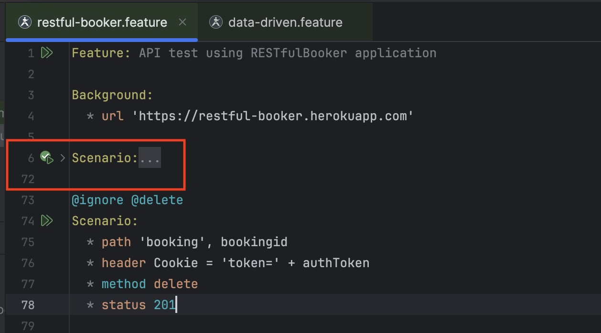

<table>
    <tr>
        <td>
             
        </td>
        <td>
            <h2>IntelliJ Plugin</h2>           
        </td>
        <th>
            <h3><a href="https://youtu.be/hkHQkrlH9xQ?si=c14DJfI6Y_K9Q414">:tv:  &nbsp;&nbsp;Video&nbsp;&nbsp;</a></h3>
        </th>        
        <th>
            <h3><a href="https://www.karatelabs.io/pricing">:heavy_dollar_sign:  &nbsp;&nbsp;Pricing&nbsp;&nbsp;</a></h3>
        </th>       
        <th>
            <h3><a href="https://plugins.jetbrains.com/plugin/19232-karate"> :zap:  &nbsp;Market&nbsp; place</a></h3>
        </th>
        <th>
            <h3><a href="https://github.com/karatelabs/intellij-plugin/issues">:octocat:  &nbsp;&nbsp;Issues&nbsp;&nbsp;</a></h3>
        </th>        
    </tr>
</table>

<table>
    <tr>
        <th>PLUS</th>
        <th>PRO</th>
        <th>ULTIMATE<th>
        <th>Enterprise</th>
    </tr>    
    <tr>
        <td>            
            <ul>
                <li>Syntax coloring</li>                
                <li>Run Feature from editor</li>
                <li><a href="#run-from-editor">Run single Scenario / Example</a></li>
                <li><a href="#run-configurations">Run Configurations</a></li>
                <li><a href="#structure-view">Structure view</a></li>
                <li><a href="#code-formatting">Code formatting</a></li>
                <li><a href="#test-results">In-IDE test results</a></li>
            </ul>
        </td>
        <td>
            <i>&nbsp;&nbsp;&nbsp;&nbsp;(includes all in PLUS)</i>
            <ul>
                <li><a href="#auto-complete">Auto complete</a></li>                
                <li><a href="#code-folding">Code folding</a></li>
                <li><a href="#references">Jump to references</a></li>
                <li><a href="#json-re-formatting">JSON re-formatting</a></li>
                <li><a href="#run-folder">Run all tests in folder</a></li>
                <li>Run Karate Labs add-ons (e.g. <a href="https://github.com/karatelabs/karate-addons/blob/main/karate-kafka/README.md">Kafka</a>)</li>
                <li><a href="#debug">Debug Karate test</a></li>
                <li>Debug Java &amp; Karate in same session</li>
                <li>Java debug session stops at Karate breakpoints</li>
                <li>cURL import *</li>
                <li>OpenAPI support *</li>
            </ul>
            <i>&nbsp;&nbsp;&nbsp;&nbsp;[*] coming soon</i>
        </td>
        <td>
            <i>&nbsp;&nbsp;&nbsp;&nbsp;(includes all in PRO)</i>
            <ul>
                <li><a href="#openapi-import">Import OpenAPI (or Swagger) definitions</a></li>
                <li><a href="#create-tests-from-spec">Convert API specifications to Karate tests</a></li>
                <li><a href="#spec-payload-chooser">Choose payload sub-sets from spec schemas</a></li>
                <li><a href="#spec-explorer">Explore API directly from OpenAPI or Swagger specs</a></li>
                <li><a href="#create-mock-from-spec">Convert API specifications to Karate mocks</a></li>
                <li><a href="#spec-impact-analysis">Impact analyis of API changes</a></li>
            </ul>
        </td>
        <td>
            <ul>
                <li>Priority support</li>
                <li>SSO / SAML support</li>
                <li><a href="#offline-license">Offline license</a></li>
                <li><a href="https://www.karatelabs.io/contact-us">Contact us</a></li>
            </ul>        
        </td>        
    </tr>
</table>

This plugin works fully-featured on [IntelliJ Community Edition](https://www.jetbrains.com/products/compare/?product=idea&product=idea-ce). JS support is built-in and **does not** require you to be running [IntelliJ IDEA Ultimate](https://www.jetbrains.com/idea/features/).

> By using this plugin, you agree to the Karate Labs [EULA](https://karatelabs.io/eula). Data on a few user actions is collected and subject to our [Privacy Policy](https://karatelabs.io/privacy-policy). HTML reports generated by the Karate open-source library has [additional analytics](https://github.com/karatelabs/karate/blob/master/karate-core/src/test/resources/analytics.md).

## License Activation
License activation and status is unified within the IntelliJ settings UI. Go to `Settings -> Languages & Frameworks -> Karate` and you should see something like this.

&nbsp;

Click the `Sign In` link and you will be taken through the usual flow linked to your existing subscription details.

Once you have authenticated successfully, copy the session ID from the browser and paste it into the input-box now showing in the IntelliJ settings view. Click `Apply` to complete the sign-in.

Once signed-in you can work offline. You can always open this settings page to see how many days are left in your session.

If you need an [offline license](#offline-license) because of strict security or similar restrictions in your environment, please [contact us](https://www.karatelabs.io/contact-us). Please note that this option is available only for enterprise customers of Karate Labs.

## Run From Editor
You can right-click a `*.feature` file in the explorer or within the editor and run it. An IntelliJ [run-configuration](#run-configurations) will be created which you can customize later if needed.

You can also run a single `Scenario` by right-clicking on it or using the "gutter" icon. Right-clicking on the gutter-icon also brings up the option to debug instead of run.

&nbsp;

You can even run a single "example" in a `Scenario Outline` by right-clicking on one of the data-rows within an `Examples` table.

## Troubleshooting

If you don't see the options to run a test (described above) make sure that the Karate icon shows for open `*.feature` files in the editor and in the project-explorer. If the "Cucumber for Java" plugin is installed, it can conflict with Karate.

&nbsp;

To make sure that the Karate plugin can run `*.feature` files, you can go to `Settings -> Editor -> File Types -> Recognized File Types`.

If you really need to mix Cucumber tests and Karate tests in the same workspace, refer to [this post on Stack Overflow](https://stackoverflow.com/a/76462277/143475).

## Run Configurations
IntelliJ [run-configurations](https://www.jetbrains.com/help/idea/run-debug-configuration.html) are useful for being able to re-run tests with specific parameters. All the typical Karate options you need are supported, including control over the JVM parameters and working directory.

## Structure View
The IntelliJ [structure view](https://www.jetbrains.com/help/idea/viewing-structure-of-a-source-file.html) is supported so you can navigate large files with ease.

## Code Formatting
Intellij [code-formatting](https://www.jetbrains.com/help/idea/reformat-and-rearrange-code.html) shortcuts work and even JSON within doc-string blocks will be formatted correctly.

## Test Results
Test results integrate into the IntelliJ test-results view. The HTML report is one-click away.

&nbsp;

When there are test errors - you can navigate directly to the feature file and line that failed by clicking on hyperlinks in the log.

## Auto Complete
Besides the syntax validation, you have auto-complete for the most commonly used keywords.

## Code Folding
You can collapse sections to make it easier to deal with long tests.

## References
You can click to navigate to called files. Or hover to see context. Currently this is supported for the `read()` and `Java.type()` syntax. More coming soon, including auto-complete.

## JSON Re-formatting
Place the cursor within JSON to see options to re-format it, you will see a "bulb" icon.

&nbsp;

The following options are possible (depending on context):

* Lenient - just like JS, where single-quotes are used and no quotes are needed for property keys
* Strict - Strict JSON, using double-quotes
* Make single Line - convert multi-line JSON to a single line
* Make multi-line - convert a single line of JSON to multi-line, including triple-quotes

## Run Folder

As a convenience, you can right-click and run a folder from the explorer view.

## Debug

You can set break-points on Karate feature files in debug mode. The Karate debugger can even step-back and hot-reload simple edits to your test. Note that the options for "Hot Reload" and "Step Back" may be hidden away in some versions of the IntelliJ UI.

### Debug Java from Karate

A Karate debug session will even stop at Java breakpoints.

### Debug Karate from Java

You can also start a normal Java debug session that uses the Karate `Runner` Java API but still stop at Karate breakpoints. This requires you to be using Karate version 1.5.0.RC3 or greater.

## Offline License

> [!IMPORTANT]  
> The Offline License is a [paid feature for enterprises](https://www.karatelabs.io/pricing). Please make sure you know who your designated admin is before you perform this step.

On the [License Activation](#license-activation) settings page, you should see a link called `Offline License`. When you click it you should see something like this.

A unique code for your system will be shown which you can cut and paste. In the example above, it is: `DhHOFKHvd7XYTi+rQnNTJQ==`

Send that unique code to your designated admin. You will be issued a license that is tied to this unique code. To apply the license, copy all the text from the license file (which should start with: `-----BEGIN LICENSE FILE-----`) and paste it into the text-area provided. Now you should see something like this.

Click [Apply] and you should a confirmation message and your license details.

## OpenAPI Import

Right-clicking on any file in the Project Explorer brings up a menu called `Karate Import` as shown below. OpenAPI or Swagger files of any version are supported.

When successful, you will see a Karate tool-window typically on the top-right of your IntelliJ layout, shown below. You can exand to the level of HTTP methods per API path such as `GET`, `POST` etc.

When you click on an HTTP method, you can preview the equivalent Karate snippet.

## Create Tests From Spec

Creating a Karate test from an Open API or Swagger file is much quicker now. Just click and drag from the tree into the editor window. 

This way you have full control over the sequence of API calls you make within a Karate test.

## Spec Payload Chooser

A challenge with complex APIs is that the schemas include all possible variations and permutations even though only some fields are commonly used. To solve this problem, you can right-click on an HTTP method in the tree. This gives you a menu to view the Request or Response when available.

This brings up a dialog where you can un-select the JSON keys you need. It is very easy to choose payload sub-sets using this UI.

Once satisfied you can cut and paste into a test or wherever you need the payload.

## Spec Explorer

Coming soon.

## Create Mock From Spec

You can export all data within an imported schema into a plain-vanilla JS file that can be used as a Karate mock. A detailed explanation and sample can be found at this GitHub project: [karate-oas-demo](https://github.com/ptrthomas/karate-oas-demo).

Use the `Save Mock` button at the bottom of the tool-window.

## Spec Impact Analysis

You can also export a plain-vanilla JS file that dumps all API and schema information in a format designed to make impact analysis easier using your existing IDE diff features. The format is designed to flatten all metdata into single lines in a text file.

Once you have exported this file, you can compare two of these using the IntelliJ `Compare With` menu and view the diff in an intuitive manner.

You can scroll-right and view the differences even for very large API schemas.

### Test Impact Analysis

Coming soon - the capability to show which tests and mocks are impacted due to changes in the API spec.