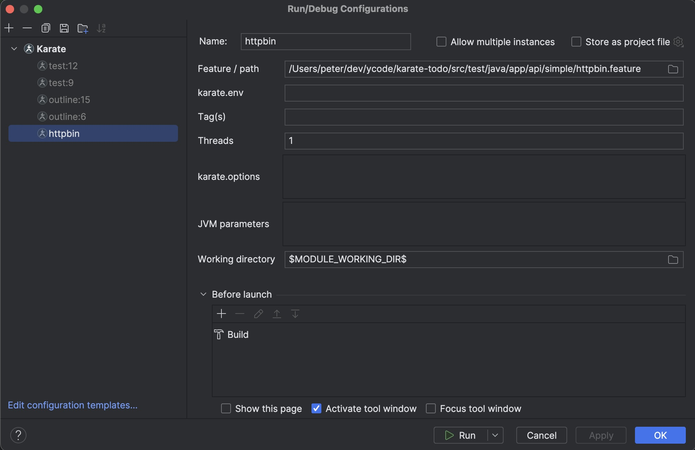

<table>
    <tr>
        <td>
             
        </td>
        <td>
            <h2>IntelliJ Plugin</h2>           
        </td>
        <th>
            <h3><a href="https://youtu.be/lytWyv0ifLk?si=7aKK6WOxVLGKjRh8">:tv:  &nbsp;&nbsp;&nbsp;Video&nbsp;&nbsp;&nbsp;</a></h3>
        </th>        
        <th>
            <h3><a href="https://www.karatelabs.io/pricing">:heavy_dollar_sign:  &nbsp;&nbsp;Pricing&nbsp;&nbsp;</a></h3>
        </th>       
        <th>
            <h3><a href="https://plugins.jetbrains.com/plugin/19232-karate">:zap:   Download</a></h3>
        </th>
        <th>
            <h3><a href="https://github.com/karatelabs/intellij-plugin/issues">:octocat:  &nbsp;&nbsp;&nbsp;Issues&nbsp;&nbsp;&nbsp;</a></h3>
        </th>        
    </tr>
</table>

<table>
    <tr>
        <th>PLUS</th>
        <th>PRO</th>
        <th>Enterprise</th>
    </tr>    
    <tr>
        <td>            
            <ul>
                <li>Syntax coloring</li>                
                <li>Run Feature from editor</li>
                <li><a href="#run-from-editor">Run single Scenario / Example</a></li>
                <li><a href="#run-configurations">Run / Launch Configurations</a></li>
                <li><a href="#structure-view">Structure / Outline view</a></li>
                <li><a href="#code-formatting">Code formatting</a></li>
                <li><a href="#test-results">In-IDE test results</a></li>
            </ul>
        </td>
        <td>
            <i>&nbsp;&nbsp;&nbsp;&nbsp;(includes all in PLUS)</i>
            <ul>
                <li><a href="#auto-complete">Auto complete</a></li>                
                <li><a href="#code-folding">Code folding</a></li>
                <li><a href="#references">Jump to references</a></li>
                <li><a href="#json-re-formatting">JSON re-formatting</a></li>
                <li><a href="#run-folder">Run all tests in folder</a></li>
                <li>Run Karate Labs add-ons (e.g. <a href="https://github.com/karatelabs/karate-addons/blob/main/karate-kafka/README.md">Kafka</a>)</li>
                <li><a href="#debug">Debug Karate test</a></li>
                <li>Debug Java &amp; Karate in same session</li>
                <li>Java debug session stops at Karate breakpoints</li>
                <li>cURL import *</li>
                <li>OpenAPI support *</li>
            </ul><i>&nbsp;&nbsp;&nbsp;&nbsp;[*] coming soon</i>
        </td>
        <td>
            <ul>
                <li>Priority support</li>
                <li>SSO / SAML support</li>
                <li>Offline license</li>
                <li><a href="https://www.karatelabs.io/contact-us">Contact us</a></li>
            </ul>        
        </td>        
    </tr>
</table>

This plugin works fully-featured on [IntelliJ Community Edition](https://www.jetbrains.com/products/compare/?product=idea&product=idea-ce). JS support is built-in and **does not** require you to be running [IntelliJ IDEA Ultimate](https://www.jetbrains.com/idea/features/).

> By using this plugin, you agree to the Karate Labs [EULA](https://karatelabs.io/eula). Data on a few user actions is collected and subject to our [Privacy Policy](https://karatelabs.io/privacy-policy). HTML reports generated by the Karate open-source library has [additional analytics](https://github.com/karatelabs/karate/blob/master/karate-core/src/test/resources/analytics.md).

## License Activation
License activation and status is unified within the IntelliJ settings UI. Go to `Settings -> Languages & Frameworks -> Karate` and you should see something like this.

&nbsp;

Click the `Sign In` link and you will be taken through the usual flow linked to your existing subscription details.

Once you have authenticated successfully, copy the session ID from the browser and paste it into the input-box now showing in the IntelliJ settings view. Click `Apply` to complete the sign-in.

Once signed-in you can work offline. You can always open this settings page to see how many days are left in your session.

If you need an offline license because of strict security or other restrictions in your environment, please [contact us](https://www.karatelabs.io/contact-us).

## Run From Editor
You can right-click a `*.feature` file in the explorer or within the editor and run it. An IntelliJ [run-configuration](#run-configurations) will be created which you can customize later if needed.

You can also run a single `Scenario` by right-clicking on it or using the "gutter" icon. Right-clicking on the gutter-icon also brings up the option to debug instead of run.

&nbsp;

You can even run a single "example" in a `Scenario Outline` by right-clicking on one of the data-rows within an `Examples` table.

## Run Configurations
IntelliJ [run-configurations](https://www.jetbrains.com/help/idea/run-debug-configuration.html) are useful for being able to re-run tests with specific parameters. All the typical Karate options you need are supported, including control over the JVM parameters and working directory.

## Structure View
The IntelliJ [structure view](https://www.jetbrains.com/help/idea/viewing-structure-of-a-source-file.html) is supported so you can navigate large files with ease.

## Code Formatting
Intellij [code-formatting](https://www.jetbrains.com/help/idea/reformat-and-rearrange-code.html) shortcuts work and even JSON within doc-string blocks will be formatted correctly.

## Test Results
Test results integrate into the IntelliJ test-results view. The HTML report is one-click away.

&nbsp;

When there are test errors - you can navigate directly to the feature file and line that failed by clicking on hyperlinks in the log.

## Auto Complete
Besides the syntax validation, you have auto-complete for the most commonly used keywords.

## Code Folding
You can collapse sections to make it easier to deal with long tests.

## References
You can click to navigate to called files. Or hover to see context. Currently this is supported for the `read()` and `Java.type()` syntax. More coming soon, including auto-complete.

## JSON Re-formatting
Place the cursor within JSON to see options to re-format it, you will see a "bulb" icon.

&nbsp;

The following options are possible (depending on context):

* Lenient - just like JS, where single-quotes are used and no quotes are needed for property keys
* Strict - Strict JSON, using double-quotes
* Make single Line - convert multi-line JSON to a single line
* Make multi-line - convert a single line of JSON to multi-line, including triple-quotes

## Run Folder

As a convenience, you can right-click and run a folder from the explorer view.

## Debug

You can set break-points on Karate feature files in debug mode. The Karate debugger can even step-back and hot-reload simple edits to your test. Note that the options for "Hot Reload" and "Step Back" may be hidden away in some versions of the IntelliJ UI.

### Debug Java from Karate

A Karate debug session will even stop at Java breakpoints.

### Debug Karate from Java

You can also start a normal Java debug session that uses the Karate `Runner` Java API but still stop at Karate breakpoints. This requires you to be using Karate version 1.5.0.RC3 or greater.

